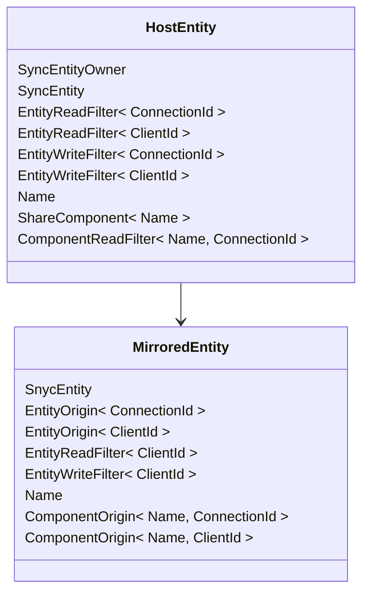

# Bevy Hookup Core

[](https://crates.io/crates/bevy_hookup_core)
[](https://docs.rs/bevy_hookup_core)

This is the core library of bevy hookup multiplayer solution. The core library is network agnostic, so it can work with any network topology and protocol.

## Usage

### Basic Sharing

All you have to do to get an entity and components mirrored on a different client is to register the required Plugins and spawn an entity with the `SyncEntityOwner` component.
Onto that entity you can then add your components with a matching `ShareComponent<TComponent>`.

```rust
fn main() {
    App::new()
        .add_plugins((
            DefaultPlugins,
            HookupCorePlugin,
            // Notice the const generic on the component plugin.
            // This is the component id that is used for deserializing, you want to make sure that no 2 components use the same component id.
            HookupComponentPlugin::<Name, 0>::default(),
        ))
        .add_systems(Startup, setup)
        .run();
}

fn setup(mut commands: Commands) {
    commands.spawn((
        SyncEntityOwner::new(),
        Name::new("Hello"),
        ShareComponent::<Name>::default(),
    ));
}
```

This is a minimal example of how you would get a name component shared onto other clients.
Keep in mind that this example doesn't have any messenger yet, which would create the connections to other clients.

This will create the following entites / components:



This looks like a lot of components, so lets go through what each of them does.

HostEntity:

| Component | What it does |
| - | - |
| `SyncEntityOwner` | This component was added manually, but all it does is keeping track on which connections this entity is shared and making sure new connections also get this entity. |
| `SyncEntity` | This component will be added to any SyncEntityOwner as well as the mirrored counterpart. It contains the `SyncEntityId` which uniquely identifies the entity across the network. |
| `EntityReadFilter< ConnectionId >` | This is the connection read filter for the entity. Per default this is set to allow all connections to read this, you can of course manually change this to exclude certain connections. Keep in mind that connections and clients aren't the same thing, excluding one connection can exclude many clients that sit behind this connection. |
| `EntityReadFilter< ClientId >` | This is the client read filter for the entity. Per default this is set to allow all clients to read this. In contrast to the connection filter, the client filter doesn't stop the message being sent to the clients, and the entity will still be mirrored, but will be disabled. This is so the resharing logic can still work across the network. |
| `EntityWriteFilter< ConnectionId >` | This is the connection write filter for the entity. Per default this is set to allow no connections to write to this. When a connection is allowed to write, it can add more components to this entity, that they control. |
| `EntityWriteFilter< ClientId >` | This is the client write filter for the entity. Per default this is set to allow no clients to write to this. It works mostly the same as the connection write filter, but for clients of course. The major difference is that a bad actor in a network could report a wrong client id, so the could impersonate someone with the write allowance. |
| `Name` | The name component we added. Any changes to this component will also be mirrored onto clients. |
| `ShareComponent< Name >` | This is the share component we added to define which components should be mirrored. It basically does the same as the `SyncEntityOwner` component, just for individual components. |
| `ComponentReadFilter< Name, ConnectionId >` | The connection read filter for a singular component. Works the same as the `EntityReadFilter< ConnectionId >`, just only for the singular component. The comonents don't support any client filtering directly, because the client filtering works by disabling the entity, which can't be done on component level. |

ClientEntity:

| Component | What it does |
| - | - |
| `SnycEntity` | The same SyncEntity as on the host. this should always have the same `SyncEntityId` on all clients |
| `EntityOrigin< ConnectionId >` | This component contains the connection id of the connection that provided the entity. Keep in mind that the connection ids are not the same across clients, this is only for local filtering. |
| `EntityOrigin< ClientId >` | This component contains the client id of the client that owns the entity. |
| `EntityReadFilter< ClientId >` | This is the same read filter that the owner of the entity provided. |
| `EntityWriteFilter< ClientId >` | This is the same write filter that the owner of the entity provided. |
| `Name` | This is the mirrored Name component. |
| `ComponentOrigin< Name, ConnectionId >` |  This component contains the connection id of the connection that provided the component. |
| `ComponentOrigin< Name, ClientId >` |  This component contains the client id of the client that owns the component. |

You can of course update all the filters on the Host entity as you please, the read filters are all on allow all per default and the write filters are on allow none.

### Resharing

If your network topology has clients that aren't directly connected, you will need resharing for those clients to share entities and components to / from each other.

For that you simple enable the required plugins and everything else should be handled for you.

```rust
fn main() {
    App::new()
        .add_plugins((
            DefaultPlugins,
            HookupCorePlugin,
            HookupComponentPlugin::<Name, 0>::default(),
            ReshareEntityPlugin,
            ReshareComponentPlugin::<Name>::default(),
        ))
        .add_systems(Startup, setup)
        .run();
}
```

The resharing works by simply attaching a `SyncEntityOwner` to every `SyncEntity` and have a read filter that filters out the connection it came from. Every shared component will of course also be continuosly shared. This will spread the Entity and Components across the network and can of course also work if you are multiple different messengers.

If you need your client id, there is a `ClientId` resource registered in the app, which you can use. To get the connection ids, you can simply query all the `Connection` components and get their ids from them.

### Event sharing

You can also share events to other clients.
For that you simple register the `HookupCorePlugin` and the `HookupEventPlugin::<TEvent, EVENT_ID>` like so:

```rust
fn main() {
    App::new()
        .add_plugins((
            DefaultPlugins,
            HookupCorePlugin,
            // Notice again the const generic. Same concept as with the component applies here, make sure no other even plugin has the same event id.
            // The component and event ids aren't conflicting, you can have a component and event with the same id with no issues.
            HookupEventPlugin::<TestEvent, 0>::default(),
        ))
        .run();
}
```

Then you just trigger a `SendEvent<TEvent>` event. In theory the `TEvent` generic doesn't have to be an actualy bevy event, just any type that is serializable.
You can optionally apply connection and client filters to the event, per default it's just allowing all connections and clients to recieve the event.
On the client end you can listen for a `ReceivedEvent<TEvent>` that will trigger when your client recieved an event.

Again, if you want to send events to clients that aren't directly connected to you, you will need to register the `ReshareEventsPlugin` plugin.
This plugin isn't generic and works for all the events out of the box.

The library filters out duplicate events in the case of a circular network topology, it does that by simply remembering the past event ids for a certain amount of time.
That does have the side effect of no longer accepting events when they are too old, this might also cause problems if one of the clients has a system clock that is far behind.
You can change the cutoff time by editing the `EventMap` resource that is registered by the `HookupCorePlugin` plugin.
The default is set to 120 seconds, which should be reasonable for most use cases.

### Scheduling

If you have systems that updated / read the components from other clients, you want to order them properly.
For systems that update components, you want them to run before the `SendComponentSystems<TComponent>` system set.
For systems that read components, you want them to run after the `ReceiveComponentSystems<TComponent>` system set.
The resahring will of course also make sure that the `ReceiveComponentSystems<TComponent>` runs before the `SendComponentSystems<TComponent>` so other clients get their updates as fast as possible.

### Buffering

There also exists a buffering helper that you can use for components that you don't want to have inconsistent updates, like a position for example.
For that you want to register the `BufferPlugin<TComponent, COMPONENT_ID, BUFFER_SIIZE>` plugin.
Notice the buffer size constant of the plugin, you can adjust that to your needs, a buffer size of 1 means that exactly 1 copy is stored every FixedUpdate, so with a buffer size of 6 the network can take 6 FixedUpdate steps before you would notice any jittering.
Now with the plugin registered you no longer need to register any `HookupComponentPlugin` yourself.
And instead of adding a `ShareComponent<TComponent>` you want to use `ShareComponent<BufferObject<TComponent>>`.

With all of that you can the look for a `Buffered<TComponent>` on the client end, that will have the buffered value.
Now make sure to use the `ReceiveBufferSystems<TComponent>` and `SendBufferSystems<TComponent>` when dealing with the ordering of systems that use buffered components.