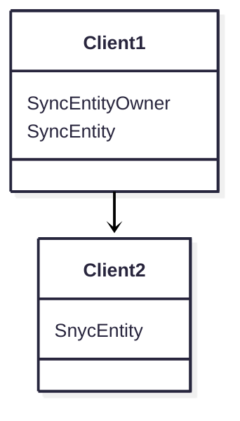

# Bevy Hookup Core

This is the core library of bevy hookup multiplayer solution. The core library is independant of whatever communication protocol is used between the clients.

## Usage

### Core

To use this library you want to add the `HookupCorePlugin` to your app. this plugin adds the ClientId resource with a randomly generated ID to your app.
Use this resource if you ever need the ClientId of your own App. The plugin also adds the handling for connections as well as for syncing entites.

### Connections

Each connection you have to any other client is resembled by the `Connection` component in your app.
Usually you never have to add this component yourself, the messenger library you use is supposed to handle that part for you.
This library supports any kind of network topology, with any amount of layer, you could build connections in a decentralized way or just have your typical client-host star topology.
If not all your clients are all directly connected you also want to check out the [Resharing](#resharing) part of the documentation.

Each connection also has a `ConnectionId` you can use for filters, but keep in mind that these connection ids are not shared across the network, this is only for client sided filtering.

### Entity Sharing

To have an entity be mirrored to other clients you want to add the `SyncEntityOwner` component.
This will also add the `SyncEntity` component which has a `SyncEntityId` that is used to identify this entity all across the network.
This will not mirror any components other than the `SyncEntity` component yet.

